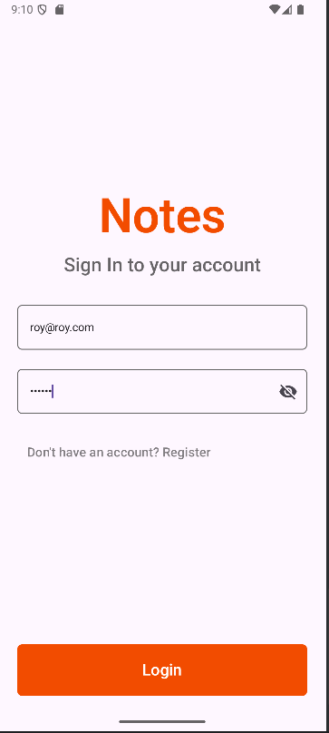
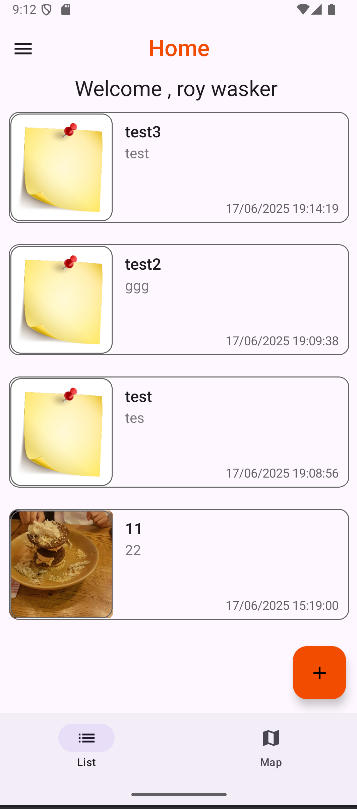
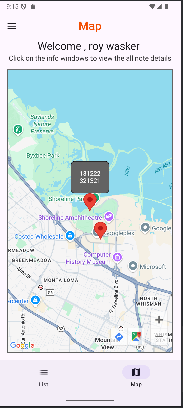
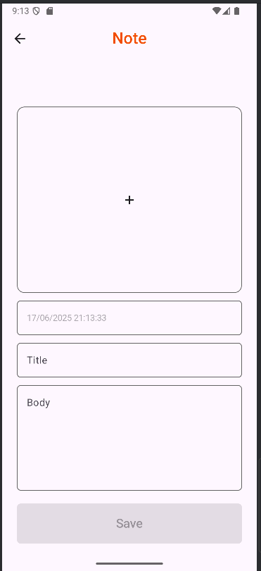

# Notes App

A Kotlin-based Android application for creating, managing, and viewing personal notes with location-based context. The app integrates Firebase for authentication and Firestore for real-time database support.

## 📱 Features

- ✍️ Create, edit, and delete personal notes
- 📍 Attach geographical location to each note
- 🗺️ View notes on an interactive map
- 🔐 Secure authentication with Firebase
- ☁️ Real-time cloud storage via Firestore
- 🎯 Simple and intuitive user interface using Jetpack Compose

## 🔧 Tech Stack

- **Kotlin**
- **Jetpack Compose** – modern UI toolkit for building native UI
- **Firebase Authentication** – secure sign-in and registration
- **Cloud Firestore** – scalable NoSQL cloud database
- **Google Maps** – location visualization
- **Koin** – dependency injection
- **MVVM architecture** – clean and scalable code structure

## 📷 Screenshots

<br><br>
<br><br>
<br><br>
<br><br>

## 🚀 Getting Started

### Clone the Repo

```bash
git clone https://github.com/roywasker/Notes.git
```

### Run the App

Open the project in Android Studio and click **Run** ▶️.